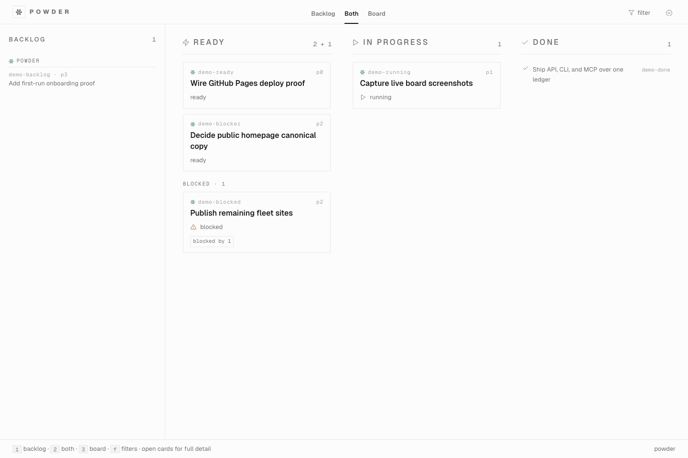

# Powder

Powder is the self-hosted work ledger for agent fleets — one live pool,
expiring claims, and a full audit trail.

When an agent crashes mid-task, its claim on the work simply expires and the
card returns to the pool for the next worker to pick up. Git-native trackers
(files committed to a repo) have no lease to expire and no clock running
against them, so a dead agent's claim just sits there forever, and nothing else
can pick it back up automatically. Powder is a live service, not a file
format, which is what makes the lease possible.



## Quickstart

Run a server, mint the first-run bootstrap key, create a card, and claim it.
No `cargo` required — either `docker run` the published image or download a
release binary.

**Option A — Docker:**

```sh
docker volume create powder-data
docker run --rm -p 4000:4000 -v powder-data:/data \
  -e POWDER_AUTH_MODE=api-key \
  -e POWDER_DISCLOSE_BOOTSTRAP_KEY=true \
  ghcr.io/misty-step/powder:latest
```

(A named volume, not a host bind mount, so the container's non-root user
always has write access regardless of host UID mapping.)

**Option B — release binary** (macOS arm64 or Linux x86_64/arm64, from the
[latest release](https://github.com/misty-step/powder/releases/latest)):

```sh
curl -fsSL -o powder.tar.gz \
  https://github.com/misty-step/powder/releases/latest/download/powder-aarch64-apple-darwin.tar.gz
tar -xzf powder.tar.gz
POWDER_DB_PATH=./data/powder.db POWDER_AUTH_MODE=api-key POWDER_DISCLOSE_BOOTSTRAP_KEY=true \
  ./powder-server
```

(Swap the tarball name for `powder-x86_64-unknown-linux-gnu.tar.gz` or
`powder-aarch64-unknown-linux-gnu.tar.gz` on Linux.)

Either option prints a bootstrap API key once on startup — copy it. Then, in
another shell:

```sh
KEY=<paste the bootstrap key>

curl -s http://localhost:4000/healthz

curl -s -X POST http://localhost:4000/api/v1/cards \
  -H "Authorization: Bearer $KEY" -H "Content-Type: application/json" \
  -d '{"id":"first-card","title":"My first card","acceptance":["it exists"]}'

curl -s -X POST http://localhost:4000/api/v1/cards/first-card/claim \
  -H "Authorization: Bearer $KEY" -H "Content-Type: application/json" \
  -d '{"agent":"me"}'
```

That's the whole loop: a card exists, is claimable, and carries a
`run_id`/`expires_at` lease the moment it's claimed. CI runs this sequence (and more)
on every change (see `.github/workflows/quickstart.yml`), so it can't
silently drift from what's in this README.

## Why Powder

- **Claims expire.** A card claimed by an agent gets a lease with a TTL. A
  crashed or hung agent's work returns to the pool automatically when the
  lease lapses — no human has to notice and manually unstick it. Git-native
  trackers have no live process to expire a lease against, so a dead agent's
  claim is permanent until someone edits a file by hand.
- **One pool, any actor.** Cron jobs, a `curl` one-liner, a phone browser, and
  a long-running orchestrator all claim, heartbeat, and complete cards through
  the same API — no actor is a first-class citizen and no actor is left
  polling a format the others don't speak.
- **Orchestrators are consumers, not competitors.** Vibe Kanban, amux, and
  similar tools can sit in front of Powder and dispatch against it; Powder is
  the durable board underneath, not another dispatch loop competing for the
  same job.
- **Audit-first, not lifecycle-enforcing.** Every claim, status change, and
  completion is a recorded event with an actor and a timestamp. Any authorized
  actor can correct a status without holding the claim — the trail stays
  honest even when the workflow doesn't.

## Learn more

- [Marketing site](https://misty-step.github.io/powder/) — screenshots and a
  feature tour.
- [Self-hosting and operations](docs/operations.md) — deployment shape,
  auth modes, key rotation, remote-mode CLI/MCP transport, and production
  runbook lore.
- [MCP contract](SKILL.md) — the shipped agent-facing usage contract.
- [`VISION.md`](VISION.md) — product direction and scope.
- [`AGENTS.md`](AGENTS.md) — repo contract: architecture boundaries, gates,
  red lines.

## What's in the repo

The repo ships the application. A deployment owns the data.

- `powder-core`: pure domain vocabulary and scheduling rules.
- `powder-shell`: effect ports for storage, time, and ids.
- `powder-store`: SQLite persistence, migrations, API keys, and transactional
  card lifecycle operations.
- `powder-api`: HTTP/API contract surface.
- `powder-cli`: human and agent command-line face.
- `powder-mcp`: MCP tool contract for agents.
- `powder-server`: single deployable HTTP app.
- `SKILL.md`: shipped agent-facing usage contract.

The dispatch daemon is not part of the core. It will consume the board through
the API/MCP/CLI surfaces and run agents elsewhere.

Repository identity is operator-facing entity data, not loose card strings.
Each repository has a canonical short name, aliases, visibility, tier
(`active`, `backburner`, or `archived`), import provenance, status counts, and
card counts. Imports may still pass full slugs such as `misty-step/canary`;
card JSON, board filters, and `/api/v1/repositories` return `canary`, while
repo filters accept either spelling. Operators can merge an alias into a
canonical repository; Powder re-homes matching cards and writes `card_events`
entries with the old and new repository names. Tier is ranking and filter
metadata only: repository listings and board stats order active repositories
first, but tier never gates lifecycle. An explicitly ready card in a
backburner or archived repository appears in ready queues and can be claimed,
released, and promoted like any other card.

Epic-shaped work is first-class without turning Powder into an execution
engine. A card may name an explicit `parent`; children are derived by query,
and the parent edge is distinct from `related`/`blocks`/`blocked_by` (it
never blocks). One parent read returns bounded child summaries plus a
deterministic `epic_state` packet -- status counts, acceptance sums, child
evidence (run proofs and links) with card-id provenance, freshness, and
parent/child mismatch flags -- computed by pure arithmetic, never transcript
concatenation. Parent acceptance stays authoritative: child completion rolls
up as an audited `rollup` event on the parent and can never complete it.
Decomposition, linkage, and rollup are all card events. Powder still
dispatches nothing; Bitterblossom or a human creates and routes children.

## Local development

Full local smoke path over the CLI, exercising the SQLite-direct transport
end to end (claim, heartbeat, renew, awaiting-input, completion,
repositories):

```sh
DB=/tmp/powder-smoke/powder.db
cargo run -q -p powder-cli -- init-db --db "$DB" --show-secret
cargo run -q -p powder-cli -- create-card --db "$DB" --id smoke-proof --title "Proof plan smoke" --acceptance "detail renders" --proof-plan "PR + HTTP smoke"
cargo run -q -p powder-cli -- list-ready --db "$DB" --limit 10
CLAIM=$(cargo run -q -p powder-cli -- claim smoke-proof --db "$DB" --agent codex)
printf "%s" "$CLAIM"
RUN_ID=$(printf "%s" "$CLAIM" | cut -f3)
cargo run -q -p powder-cli -- heartbeat smoke-proof --db "$DB" --run "$RUN_ID"
cargo run -q -p powder-cli -- renew-claim smoke-proof --db "$DB" --run "$RUN_ID" --ttl 3600
cargo run -q -p powder-cli -- update-status smoke-proof --db "$DB" --status running
cargo run -q -p powder-cli -- request-input "$RUN_ID" --db "$DB" --question "Approve completion?"
cargo run -q -p powder-cli -- list-awaiting-input --db "$DB"
cargo run -q -p powder-cli -- answer-input "$RUN_ID" --db "$DB" --actor operator --answer approved
cargo run -q -p powder-cli -- check-criterion smoke-proof --db "$DB" --criterion 0 --actor operator
cargo run -q -p powder-cli -- get-card smoke-proof --db "$DB"
cargo run -q -p powder-cli -- get-run "$RUN_ID" --db "$DB"
cargo run -q -p powder-cli -- complete-card smoke-proof --db "$DB" --criterion-proof 0=https://example.test/proof
cargo run -q -p powder-cli -- repository-list --db "$DB" --include-hidden
cargo run -q -p powder-cli -- repository-upsert --db "$DB" --name canary --aliases misty-step/canary --tier active
cargo run -q -p powder-cli -- repository-merge-alias --db "$DB" --alias misty-step/canary --into canary --actor operator
POWDER_DB_PATH="$DB" cargo run -q -p powder-mcp
```

For remote-mode CLI/MCP transport, key rotation, and everything else an
operator needs to run a deployment, see
[`docs/operations.md`](docs/operations.md).

## Gate

```sh
test -z "$(find . -type d -name backlog.d -not -path './.git/*' -print -quit)"
cargo fmt --all -- --check
cargo clippy --workspace --all-targets -- -D warnings
cargo test --workspace
```

Pull requests run the same gate through GitHub Actions as
`Rust CI / fmt-clippy-test`. The `master` branch protection rule requires that
status check with strict status checks and admin enforcement enabled. The
Landmark release-note workflow remains release-only and does not replace the
Rust gate.
